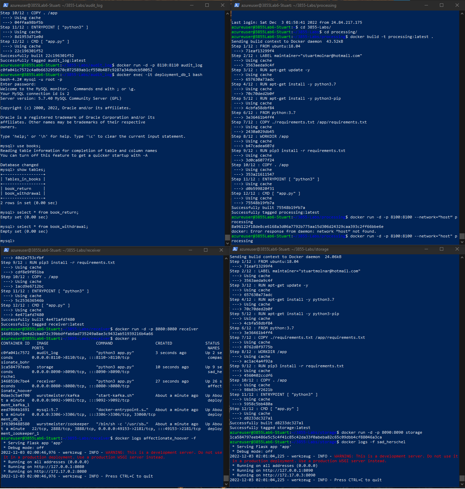
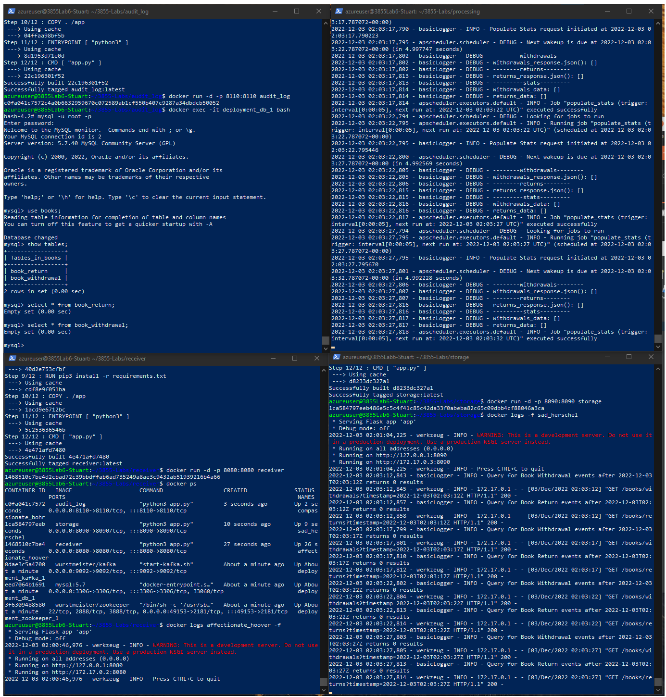
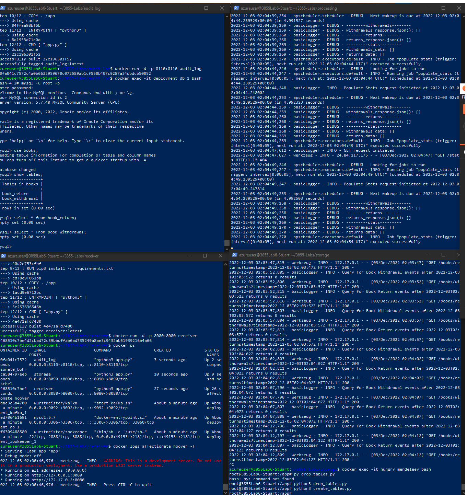
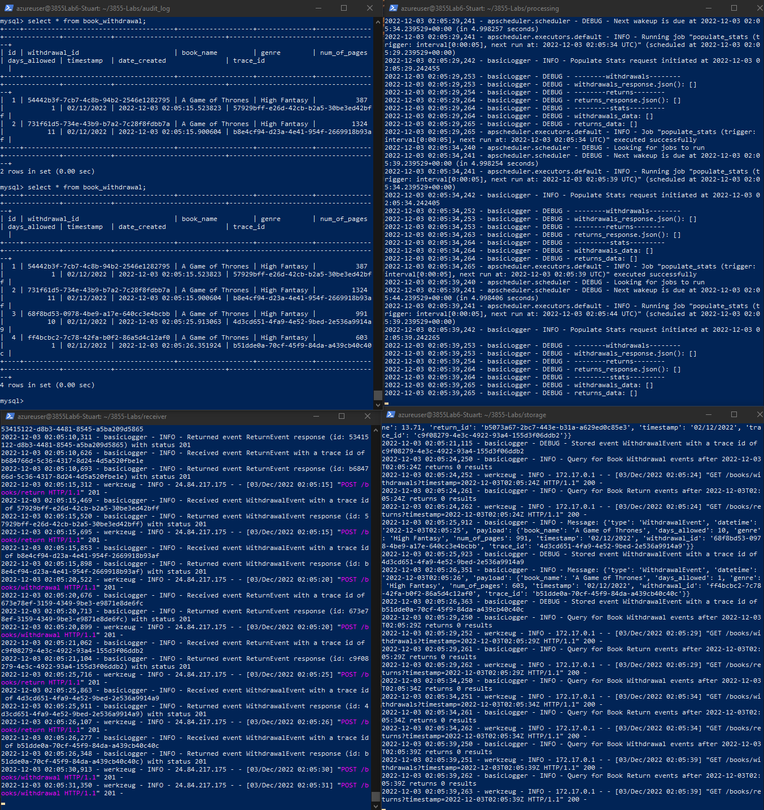

<h4> Issue </h4>

Processing service does not store events on VM.

<h4>Hard to reproduce errors</h4>

- mySQL does not store events
- Processing service stores the error 500 message from Storage, and then throws an error itself

<h4>1st</h4>

<h4>2nd</h4>

<h4>3rd</h4>

<h4>4th</h4>

