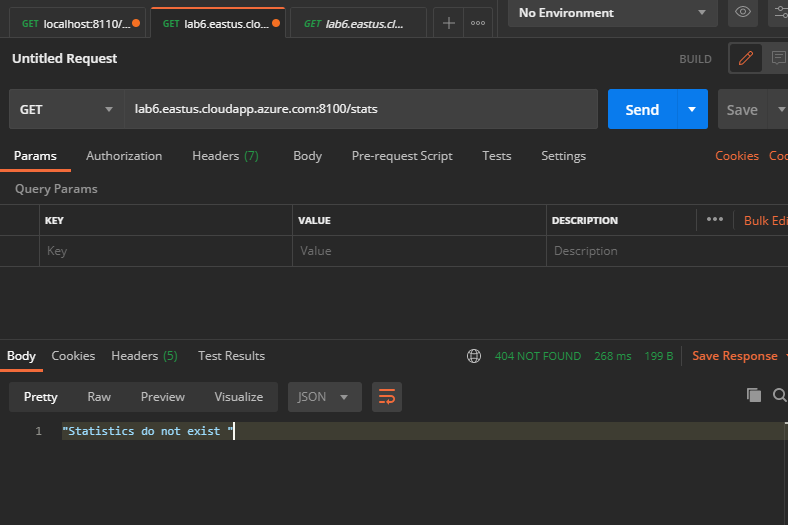
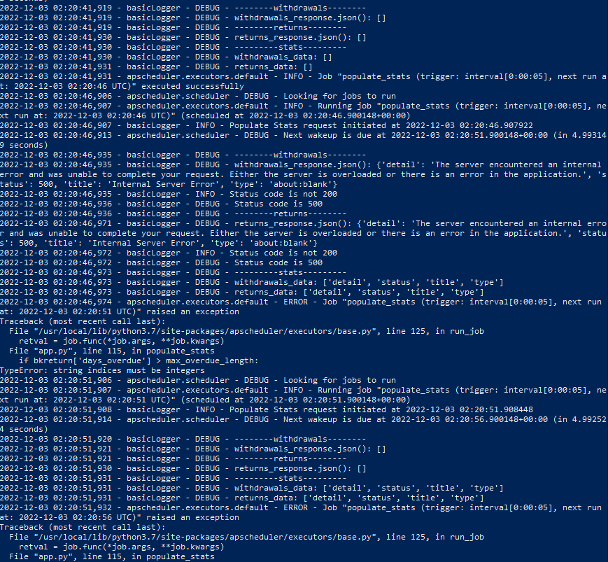

<h4> Issue </h4>

- Processing service does not store events on VM.

<h4>Hard to reproduce errors</h4>

- mySQL does not store events
- Processing service stores the error 500 message from Storage, and then throws an error itself (screenshot at bottom)

<h4>1st</h4>

<h4>2nd</h4>

<h4>3rd</h4>

<h4>4th</h4>

<h4>postman for audit log</h4>

<h4>postman for processing</h4>

<h4>error 500 issue</h4>

