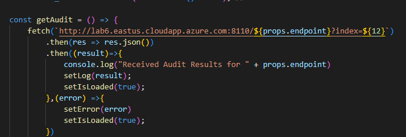
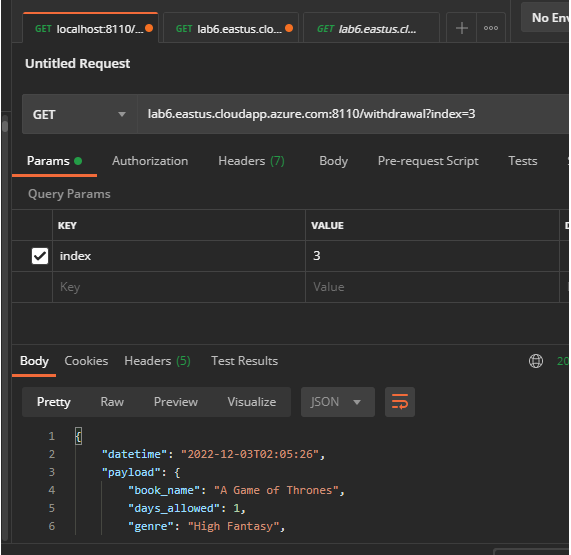

<h4>Lab 8</h4>

<h4>Processing service

<h4>With 10 in database</h4>

<h4></h4>

<h4></h4>

<h4>Add 2 more to database, index 12 should now be available</h4>

<h4></h4>

<h4></h4>

----------------------------------------------------

<h4> Issue </h4>

- Processing service does not store events on VM.

<h4>Hard to reproduce errors</h4>

- mySQL does not store events
- Processing service stores the error 500 message from Storage, and then throws an error itself

As of right now, mysql is storing events

Cause of mysql error:
- unknown

Causes of error 500 message: 
- dropping mysql tables while processing service is running
- unknown second cause
 Fix to first cause: take processing service down before recreating tables

<h4>1st</h4>

<h4>2nd</h4>

<h4>3rd</h4>

<h4>4th</h4>

<h4>postman for audit log</h4>

<h4>postman for processing</h4>

